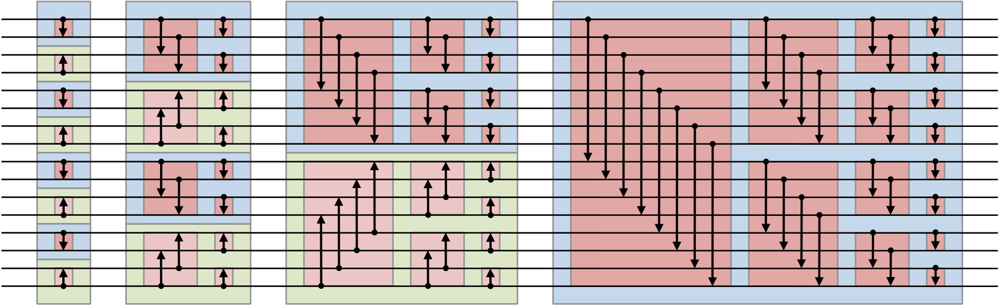

## Petunjuk penggunaan program
    Compile : jalankan command ‘make’ pada terminal
    Run	: jalankan command ./bitonic_sort <panjang_array>

## Pembagian tugas
### Arno Alexander / 13515141       :
        __global__ void bitonic_sort_step(int *dev_values, int j, int k)
        void compare(int i, int j, int dir)
        void bitonicMerge(int low, int c, int dir)
        void sort_serial()
        void print_elapsed(clock_t start, clock_t stop)
        void array_fill(int *arr, int length)

### Zacki Zulfikar Fauzi / 13515147	:
        void bitonic_sort(int *values)
        int greatestPowerOfTwoLessThan(int n)
        void recursiveBitonic(int low, int c, int dir)
        int is_sorted()
        int main(int argc, char * argv[])

## Deskripsi Solusi Paralel
Misalkan kita memiliki sebuah array sepanjang NUM_VALS yang ingin diurutkan menggunakan parallel bitonic sort dengan dimensi grid sebesar BLOCKS dan dimensi block sebesar THREADS. Tentukan seluruh pasangan bilangan bulat (j, k) di mana j dan k adalah bilangan hasil perpangkatan dari dua, k berada di rentang 2 hingga NUM_VALS, j berada di rentang 1 hingga k/2. Untuk setiap pasangan (j, k) yang memenuhi syarat itu, jalankan fungsi antara bitonic sort dengan parameter j dan k tersebut.
Fungsi antara bitonic sort dimulai dengan menginisialisasi variabel bantu i dan ixj, di mana i = threadIdx.x + blockDim.x * blockIdx.x dan ixj = i ^ j. Jika ixj > i dan i & k = 0, dan elemen array indeks ke i lebih besar daripada elemen array indeks ke ixj, tukar nilai kedua elemen tersebut. Jika ixj > i dan i & k tidk sama dengan 0, dan elemen array indeks ke i lebih kecil daripada elemen array indeks ke ixj, tukar juga nilai kedua elemen tersebut. 

## Analisis Solusi
Jika overhead pembuatan thread diabaikan, solusi paralel yang kami implementasikan merupakan solusi terbaik karena pekerjaan yang dapat dilakukan secara bersamaan telah didistribusikan secara paralel ke dalam beberapa thread.

## Jumlah thread yang digunakan
Untuk solusi paralel, jumlah proses yang digunakan adalah 512.

## Hasil pengukuran kerja

### N=512
    Test 1
    Serial	:696 microseconds
    Paralel	: 755568  microseconds

    Test 2
    Serial	: 606 microseconds
    Paralel	:  753259 microseconds

    Test 3
    Serial	: 606 microseconds
    Paralel	: 765808 microseconds

    Rata-rata
    Serial	: 636 microseconds
    Paralel	: 758211,6667 microseconds
    Speedup : 0,000838816

### N=1.024

    Test 1
    Serial	: 1258 microseconds
    Paralel	: 781203 microseconds

    Test 2
    Serial	: 1260 microseconds
    Paralel	: 758902 microseconds

    Test 3
    Serial	: 1357 microseconds
    Paralel	: 756638 microseconds

    Rata-rata
    Serial	: 1291,666667 microseconds
    Paralel	: 765581 microseconds
    Speedup : 0,001687172

### N=4.096

    Test 1
    Serial	: 4142 microseconds
    Paralel	: 226066 microseconds

    Test 2
    Serial	: 7352 microseconds
    Paralel	: 754204 microseconds

    Test 3
    Serial	: 6825 microseconds
    Paralel	: 756650 microseconds

    Rata-rata
    Serial	: 6106,333333 microseconds
    Paralel	: 578973,3333 microseconds
    Speedup : 0,01054683

### N=65.536

    Test 1
    Serial	: 135428 microseconds
    Paralel	: 189378 microseconds

    Test 2
    Serial	: 102229 microseconds
    Paralel	: 756721 microseconds

    Test 3
    Serial	: 102305 microseconds
    Paralel	: 746837 microseconds

    Rata-rata
    Serial	: 113320,6667 microseconds
    Paralel : 564312 microseconds
    Speedup	: 0,20081208

### N=262144

    Test 1
    Serial	: 492075 microseconds
    Paralel	: 756961 microseconds

    Test 2
    Serial	:  491998 microseconds
    Paralel	: 753429 microseconds

    Test 3
    Serial	: 491906 microseconds
    Paralel	: 762420 microseconds

    Rata-rata
    Serial	: 491993 microseconds
    Paralel	: 757603,3333 microseconds
    Speedup	: 0,649407122

### N=1.048.576

    Test 1
    Serial	: 2342744 microseconds
    Paralel	: 777152 microseconds

    Test 2
    Serial	:  2633709 microseconds
    Paralel	: 217701 microseconds

    Test 3
    Serial	: 2322403 microseconds
    Paralel	: 769679 microseconds

    Rata-rata
    Serial	: 2432952 microseconds
    Paralel	: 588177,3333 microseconds
    Speedup	: 4,136425976

### N=8.388.608

    Test 1
    Serial	: 23678612 microseconds
    Paralel	: 320305 microseconds

    Test 2
    Serial	:  23255186 microseconds
    Paralel	: 927840 microseconds

    Test 3
    Serial	: 23291978 microseconds
    Paralel	: 922723 microseconds

    Rata-rata
    Serial	: 23408592 microseconds
    Paralel	: 723622,6667 microseconds
    Speedup	: 32,34916909

## Analisis
Pada panjang array yang kecil, speedup lebih kecil dibandingkan saat panjang array besar. Hal tersebut terjadi karena overhead thread memiliki besar yang sama akibat banyaknya thread didefinisikan di awal. Sementara itu, waktu pemrosesan murninya berbanding lurus dengan panjang array. Oleh karena itu, pada array kecil, persentase waktu yang dihabiskan untuk mengurus thread lebih besar dibandingkan dengan array besar, sehingga speedup menjadi lebih kecil. Dari hasil pengujian, dapat disimpulkan bahwa overhead thread cukup berpengaruh pada waktu pemrosesan sort array dengan jumlah elemen kecil sehingga untuk jumlah elemen yang sedikit lebih baik digunakan sorting secara serial. Sedangkan untuk jumlah elemen yang besar, overhead thread tidak begitu signifikan terhadap waktu pengurutan elemen sehingga sorting secara paralel lebih cocok untuk digunakan pada array dengan jumlah elemen yang besar.

